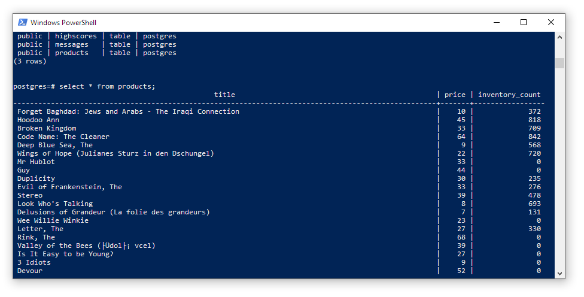

# Shopify Challenge S19

Personal *Shopify Summer 2019 Developer Intern Challenge* solution.

A RESTful NodeJS + PostgreSQL API. Attempting to go start to finish in a single evening, 5PM - 10PM.

**Documentation:** <https://ryanfleck.github.io/Shopify-Challenge-S19/>

**Heroku Container:** <https://rcf-shopify-s19.herokuapp.com>

**Technology Used:**
- NodeJS <https://nodejs.org/en/>
- Express <https://expressjs.com/>
- PostgreSQL <https://www.postgresql.org/>

## Development Notes

- To develop: `npm run develop`
- To run: `npm run start`
- Use `.env` file to store postgres connection string as `DATABASE_URL`.
- Use `psql DB UNAME` to login and `\dt` to show relations.

Nice, db is full of sample data from <https://mockaroo.com/>:

Fantastic - Heroku logs can be streamed ` heroku logs -a rcf-shopify-s19 --tail`

## Resources

1. GraphQL JS Docs <https://graphql.org/code/#javascript>
1. Postman Docs <https://learning.getpostman.com/docs>

## Time Tracking

1. **2018-01-13** - 3h - Decided to apply to Shopify and start the challenge.
1. **2018-01-14** - 3h - Last day to work before deadline! Removed GraphQL bits. Deployed to Heroku. No unit testing yet.
